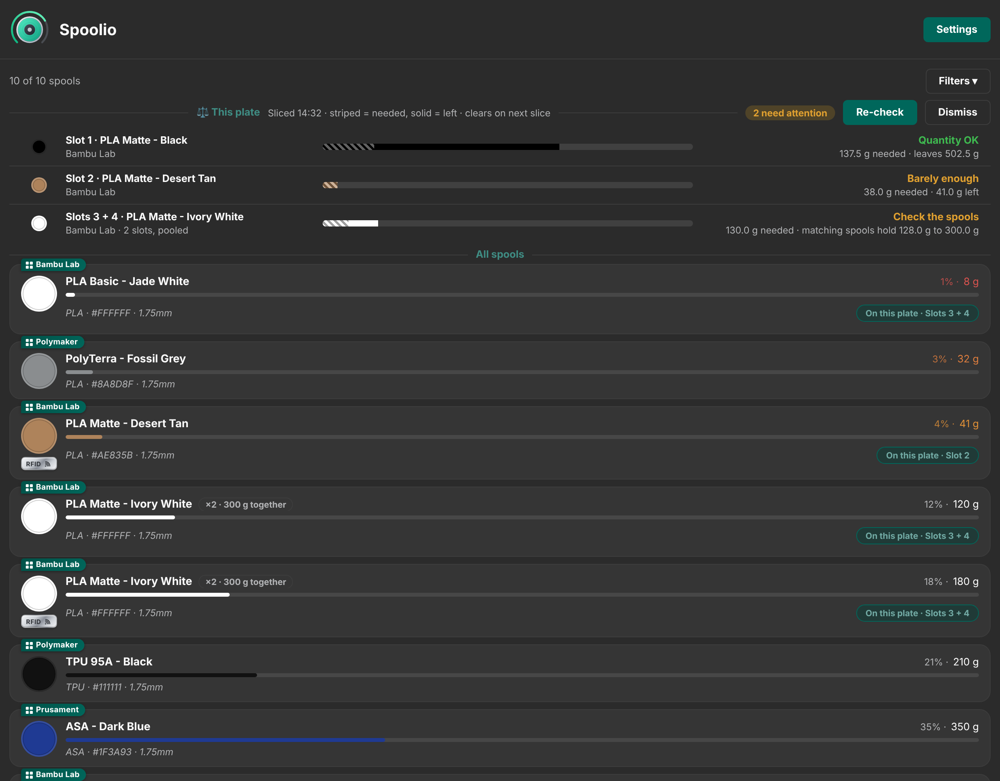
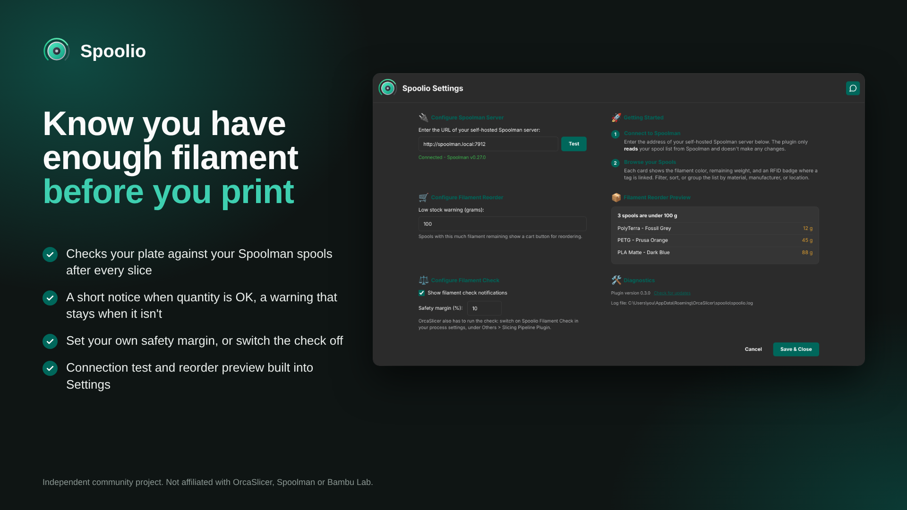

  

# Spoolio for OrcaSlicer

Spoolio _(Spool Inventory Overview)_ is a Bambu Lab inspired filament inventory plugin for OrcaSlicer, powered by your self-hosted [Spoolman](https://github.com/Donkie/Spoolman) server. It only ***reads*** from Spoolman and doesn't make any changes.

> [!IMPORTANT]
> Spoolio ***<ins>is not</ins>*** a filament profile manager (nozzle temps, flow ratios, pressure advance etc) those settings are configured in your filament profiles within OrcaSlicer.  If you're looking for a tool that covers this then I would recommend [PipSpool](https://github.com/Gadonk/pipspool-orcaslicer) or [FilamentHub](https://github.com/WeLizard/FilamentHub). 

This plugin is best used in parallel with [HaspelSync](https://github.com/Rdiger-36/HaspelSync) which tracks your filament usage and automatically updates Spoolman.  

## Key Features
- **Spool cards:** Showing colour, vendor, remaining weight, a progress bar in the spool's own colour and material / colour hex / diameter details.
- **RFID badge:** On spools that have a tag linked in Spoolman (requires Spoolman v.0.27.0 or newer).
- **Filter, sort and group:** By material, manufacturer or location.
- **Low-stock reorder button:** Spools under the user defined threshold will generate a cart icon on the card that opens a web search for reordering (either by a user input Spoolman article no. or it defaults to the filament name)
- **Filament check when slicing:** After each slice, Spoolio checks the plate's filament against your matching spools and shows a notification in OrcaSlicer: a short-lived one when there's enough, and one that stays until dismissed when there may not be enough filament loaded.
- **Guided settings:** With a connection test before your Spoolman address can be saved.
- Matches OrcaSlicer's **light and dark theming**.
- Built for **Windows, macOS and Linux** (x86_64 and arm64).

## Images

  

  

## Requirements

- A current OrcaSlicer **nightly build** (tested on 2.5.0-dev `1d577ea4` and confirmed as working).
- A self-hosted Spoolman server (v0.27.0 or newer required to show RFID tags).

## Install

**From Orca Cloud:** subscribe to Spoolio in the Plugin Hub, then in
OrcaSlicer open ***File > Plugins***, click ***Refresh*** and tick ***Activate***.

**Manually:** download the file for your system from the [latest release](../../releases/latest):

| System | File |
|---|---|
| Windows (x86_64) | `spoolio_win_x86_64.py` |
| Windows (arm64) | `spoolio_win_arm64.py` |
| Linux (x86_64) | `spoolio_linux_x86_64.py` |
| Linux (arm64) | `spoolio_linux_arm64.py` |
| macOS (Apple silicon) | `spoolio_macosx_arm64.py` |
| macOS (Intel) | `spoolio_macosx_x86_64.py` |

Place it in its own folder called `spoolio` inside OrcaSlicer's plugin directory (one Spoolio file per folder):

| OS | Plugin directory |
|---|---|
| Windows | `%APPDATA%\OrcaSlicer\orca_plugins\` |
| macOS | `~/Library/Application Support/OrcaSlicer/orca_plugins/` |
| Linux | `~/.config/OrcaSlicer/orca_plugins/` |

Restart OrcaSlicer, then tick ***Activate*** for Spoolio. A **Spoolio** tab appears in the top bar.

## Set Up

The Spoolio tab opens on its Settings page on first run. Enter your Spoolman server address (for example `http://raspberrypi.local:7912`), click ***Test***, once the connection is confirmed then ***Save & Close***, which takes you back to your spool list. You can also set the low-stock threshold here, and reopen the page any time with the ***Settings*** button.

OrcaSlicer asks before a plugin does anything sensitive. Expect a prompt the first time the plugin connects to Spoolman, and another the first time you click a reorder cart to open your browser.

> [!NOTE]
> ### Filament Check 
> After each slice, Spoolio compares the filament the plate needs with what is left on your spools. You get a short-lived notification when there is enough, and one that stays until you dismiss it when there may not be enough filament loaded.
>
> To use it, switch on **Spoolio Filament Check** in your process settings, under **Others > Slicing Pipeline Plugin**. You can hide its notifications, or change its safety margin (10% by default), on the Settings page.
>
> - Each filament the plate uses is matched to spools in Spoolman by vendor, material and colour. Slots that hold the same filament are treated as one supply, because the AMS moves on to the next spool of the same filament when one runs out: their use is added together and compared with the spools' combined weight. Spare spools that aren't loaded never count towards it.
> - If a matching spool is too low to cover the plate and could be the one that is loaded, you get a warning to make sure the right spool is loaded. Archive finished spools in Spoolman so they aren't counted.
> - If no spool matches, or Spoolman can't be reached, you get a short note and nothing else.
> - Slicer figures are estimates and real use can differ a little, so the safety margin gives you headroom.
> - Like the rest of Spoolio, it only reads from Spoolman.

## Feedback

Encounter a problem or have an idea? Please
[report a bug](../../issues/new?template=bug_report.yml) or
[request a new feature](../../issues/new?template=feature_request.yml).

## Acknowledgements

- [**Spoolman**](https://github.com/Donkie/Spoolman) by Donkie and contributors.
- [**OrcaSlicer**](https://github.com/OrcaSlicer/OrcaSlicer) by SoftFever and
  contributors.
- The **Bambu Handy** app, whose spool cards inspired the design.

This is an independent project and is not affiliated with or endorsed by Spoolman, OrcaSlicer or Bambu Lab.

## License

GNU General Public License v3.0 - see [LICENSE](LICENSE).
