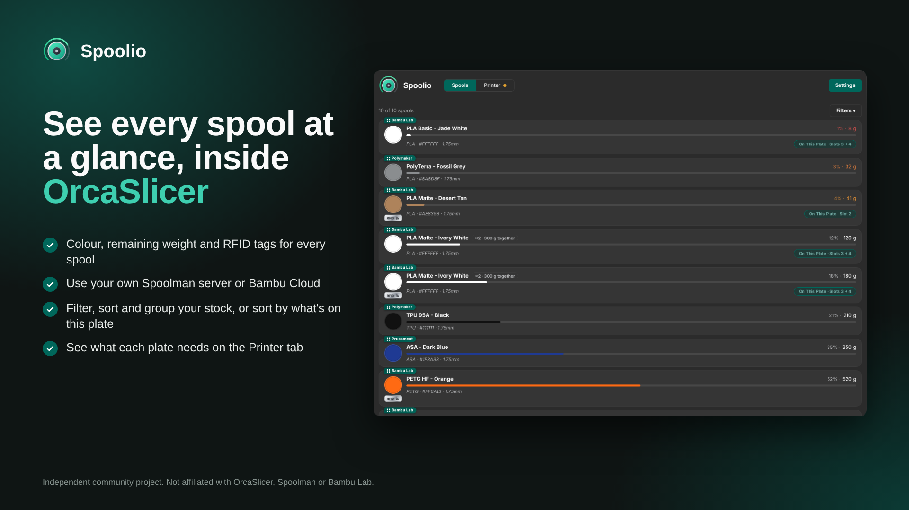
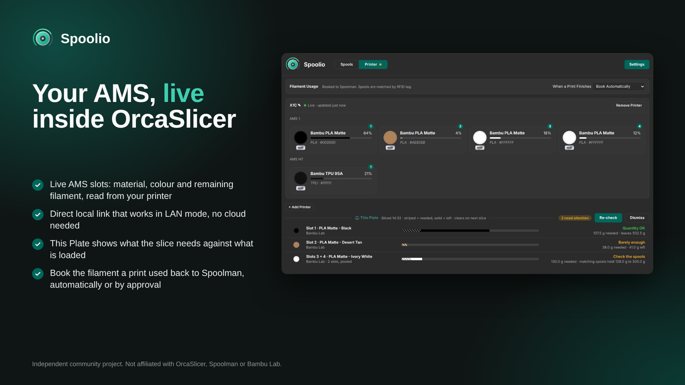
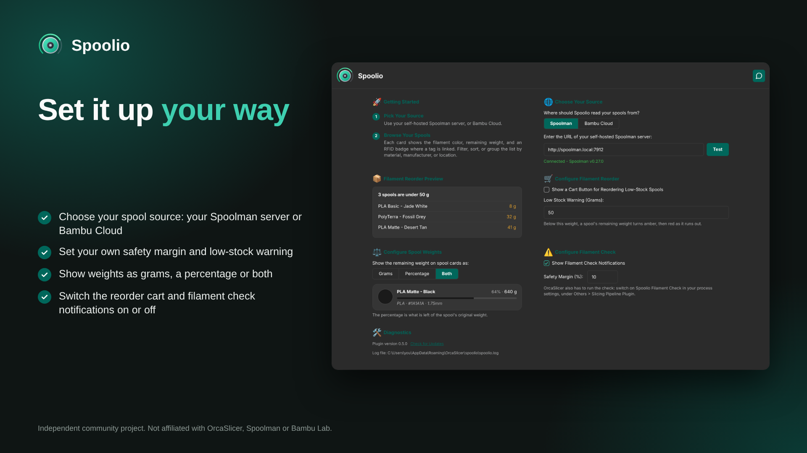

  

# Spoolio for OrcaSlicer

Spoolio _(Spool Inventory Overview)_ is a Bambu Lab inspired filament inventory plugin for OrcaSlicer, powered by your self-hosted [Spoolman](https://github.com/Donkie/Spoolman) server or your Bambu Cloud account.

> [!IMPORTANT]
> Spoolio ***<ins>is not</ins>*** a filament profile manager (nozzle temps, flow ratios, pressure advance etc) those settings are configured in your filament profiles within OrcaSlicer.  If you're looking for a tool that covers this then I would recommend [PipSpool](https://github.com/Gadonk/pipspool-orcaslicer) or [FilamentHub](https://github.com/WeLizard/FilamentHub). 

## Key Features
- **Spool cards:** Showing colour, vendor, remaining weight, a progress bar in the spool's own colour and material / colour hex / diameter details. Choose whether the weight shows as grams, a percentage or both.
- **Two spool sources:** Your self-hosted Spoolman server, or your Bambu Cloud account.
- **RFID badge:** Reads from the spool's `tag` extra field when present, otherwise from the Spoolman tags field (requires Spoolman v.0.27.0 or newer).
- **Filter, sort and group:** By material, manufacturer or location.
- **Low-stock warning:** Spools under the user defined threshold have their remaining weight turn amber, shading to red as the spool runs out.
- **Optional reorder button:** Switch on the cart icon in Settings and low-stock spools get a button that opens a web search for reordering (either by a user input Spoolman article no. or it defaults to the filament name).
- **Filament check when slicing:** After each slice, Spoolio checks the plate's filament against your matching spools and shows a notification in OrcaSlicer: a short-lived one when there's enough, and one that stays until dismissed when there may not be enough filament loaded.
- **This Plate panel:** Shown after each slice on the Printer tab, with a progress bar for the estimated filament consumption, an **On This Plate** chip on the matching cards, and a marker where you hold several spools of one filament.
- **Printer tab:** A card per printer showing what is loaded in each AMS and external spool. Build your own by adding printers and AMS units and assigning your spools to the slots, with either spool source.
- **Live Link:** Connect directly to a printer on your local network (works in LAN mode) to show what the printer itself reports for each slot, including the spools it identifies by RFID.
- **Filament usage booking:** With Spoolman, after a print finishes Spoolio can book the filament used from the sliced G-code to the spool that was loaded, matched by RFID tag. Book it yourself or let Spoolio do it.
- **Guided settings:** With a connection test before your Spoolman address can be saved.
- Matches OrcaSlicer's **light and dark theming**.
- Built for **Windows, macOS and Linux** (x86_64 and arm64).

## Images

  

  

  

## Requirements

- A current OrcaSlicer **nightly build** (tested on 2.5.0-dev `1d577ea4` and confirmed as working).
- A self-hosted Spoolman server (v0.27.0 or newer required to show RFID tags), or a Bambu Cloud account.
- For Live Link: a printer on the same network as your computer with LAN mode on.  Currently tested on Bambu Lab printers only.

## Install

**From Orca Cloud:** subscribe to Spoolio in the Plugin Hub, then in
OrcaSlicer open ***File > Plugins***, click ***Refresh*** and tick ***Activate***.

**Manually:** download the file for your system from the [latest release](../../releases/latest):

| System | File |
|---|---|
| Windows (x86_64) | `spoolio_win_x86_64.py` |
| Windows (arm64) | `spoolio_win_arm64.py` |
| Linux (x86_64) | `spoolio_linux_x86_64.py` |
| Linux (arm64) | `spoolio_linux_arm64.py` |
| macOS (Apple silicon) | `spoolio_macosx_arm64.py` |
| macOS (Intel) | `spoolio_macosx_x86_64.py` |

Place it in its own folder called `spoolio` inside OrcaSlicer's plugin directory (one Spoolio file per folder):

| OS | Plugin directory |
|---|---|
| Windows | `%APPDATA%\OrcaSlicer\orca_plugins\` |
| macOS | `~/Library/Application Support/OrcaSlicer/orca_plugins/` |
| Linux | `~/.config/OrcaSlicer/orca_plugins/` |

Restart OrcaSlicer, then tick ***Activate*** for Spoolio. A **Spoolio** tab appears in the top bar.

## Set Up

The Spoolio tab opens on its Settings page on first run. Enter your Spoolman server address (for example `http://raspberrypi.local:7912`), click ***Test***, once the connection is confirmed then ***Save & Close***, which takes you back to your spool list. You can also set the low-stock threshold, the cart button and how weights are shown here, and reopen the page any time with the ***Settings*** button.

Prefer Bambu Cloud? Choose ***Bambu Cloud*** under ***Choose Your Source***, enter your Bambu email and password, pick Global or China, and enter the verification code if Bambu asks for one. Spoolio never stores your password, only the sign-in token Bambu returns, and ***Sign Out*** removes it.

OrcaSlicer asks before a plugin does anything sensitive. Expect a prompt the first time the plugin connects to Spoolman or Bambu Cloud, and another the first time you click a reorder cart to open your browser.

> [!TIP]
> ### Printer Tab
> The **Printer** tab sits beside **Spools** and shows a card for each of your printers. Click ***+ Add Printer***, then add an AMS (4 slots), an AMS HT (1 slot) or an external spool, you can create it to match your setup, and use ***+ Assign Spool*** to choose which of your spools is in each slot. This is stored in Spoolio only and nothing is changed in Spoolman or Bambu Cloud. With Bambu Cloud, spools your library has linked to a slot also show, but that can lag behind what is physically loaded.
>
> ### Live Link
> To read a printer directly, press ***Live Link*** on its card and enter its IP address, its serial number (optional, but helps if you have several printers) and its access code, all found in the printer's network settings with LAN mode on. The slots then show what the printer reports and how long ago it was updated. Spoolio keeps the access code in a private file on your computer and only reads from the printer. Removing a printer also removes its Live Link.

> [!TIP]
> ### Filament Usage Booking
> With Spoolman as your source and a Live Link on the printer, Spoolio can book the filament a print used. When a print finishes, it works out which spool was in each slot from the RFID tag, matching it to your Spoolman spools by the `tag` extra field on the spool (or the long serial Bambu uses for RFID detection), and books the grams from the sliced G-code to that spool. Under ***When a Print Finishes*** choose ***Ask Me Before Booking***, ***Book Automatically*** or ***Do Not Track***.
>
> Slots whose spool can't be identified, and prints that were cancelled (where the grams are estimated from the progress), always have to be booked manually, and nothing is booked twice. Bambu Cloud has no booking, as there is no way to write to its filament library.

> [!IMPORTANT]
> ### Bambu Cloud Limitations
> - **Read only.** Spoolio can read your Bambu filament library but cannot write to it, so nothing you do in Spoolio changes your Bambu spools.
> - **No usage booking.** Filament usage booking is only available with Spoolman. Spoolio has no way to write used weight back to the Bambu library, and I haven't verified whether Bambu tracks remaining weight itself for RFID spools.
> - **No live AMS through the cloud.** A printer in LAN mode isn't bound to your account, so Bambu Cloud doesn't list it and sends no AMS data. Use ***Live Link*** (works with either source) for live slots, or assign spools by hand.
> - **Slot view can lag.** The spools your library has linked to a slot are a representative view only and can differ from what is physically loaded.
> - **Unofficial and experimental.** This uses Bambu's unofficial cloud service, which Bambu can change without notice. If it stops working, sign out and back in, if that still fails then please report it.
> - **Sign-in expires.** Spoolio keeps only the sign-in token, not your password, so when Bambu expires the token you'll be asked to sign in again from Settings.
> - **Printer tab setup is local.** Printers, AMS units and slot assignments you set up are stored in Spoolio on your computer, not in your Bambu account.
>
> ### Live Link and Booking Limitations
> - Live Link needs the printer on the same network with LAN mode on, and only connects while the Printer tab is open or usage booking is on.
> - Booking assumes the slicer's filament slots follow the order of the printer's slots (AMS 1 slots 1 to 4, then the next AMS, and so on), so check the first few bookings if you use a different mapping.
> - Slicer weights are estimates, and cancelled prints are estimated from the progress, so booked amounts can differ slightly from what was really used.

> [!TIP]
> ### Filament Check 
> After each slice, Spoolio compares the filament the plate needs with what is left on your spools. You get a short-lived notification when there is enough, and one that stays until you dismiss it when there may not be enough filament loaded.
>
> To use it, switch on ***Spoolio Filament Check*** in your process settings, under ***Others > Slicing Pipeline Plugin***. The results also appear in a **This Plate** panel on the Printer tab, where **Re-check** runs it again with fresh data and **Dismiss** hides it until the next slice. You can hide the notifications and the panel, or change the safety margin (10% by default), on the Settings page.
>
> - Each filament the plate uses is matched to spools in Spoolman by vendor, material and colour. Slots that hold the same filament are treated as one supply, because the AMS moves on to the next spool of the same filament when one runs out: their use is added together and compared with the spools' combined weight. Spare spools that aren't loaded never count towards it.
> - If a matching spool is too low to cover print on the plate, and you have another spool available to the one that is loaded, you get a warning to make sure the right spool is loaded. Archive finished spools in Spoolman so they aren't counted.
> - If no spool matches, or Spoolman can't be reached, you get a short note and nothing else.
> - Slicer figures are estimates and real use can differ a little, so the safety margin gives you headroom.

## Feedback

Encounter a problem or have an idea? Please
[report a bug](../../issues/new?template=bug_report.yml) or
[request a new feature](../../issues/new?template=feature_request.yml).

## Acknowledgements

- [**Spoolman**](https://github.com/Donkie/Spoolman) by Donkie and contributors.
- [**OrcaSlicer**](https://github.com/OrcaSlicer/OrcaSlicer) by SoftFever and
  contributors.
- The **Bambu Handy** app, whose spool cards inspired the design.

This is an independent project and is not affiliated with or endorsed by Spoolman, OrcaSlicer or Bambu Lab.

## License

GNU General Public License v3.0 - see [LICENSE](LICENSE).
